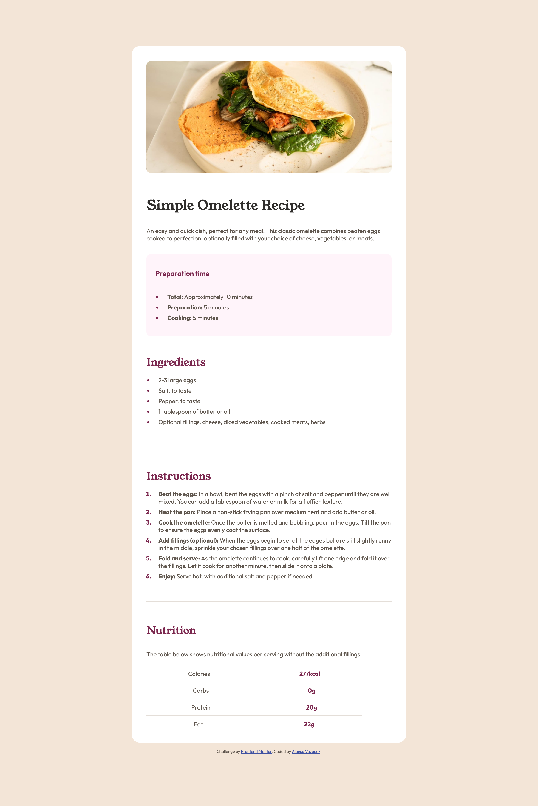

# Frontend Mentor - Recipe page solution

This is a solution to the [Recipe page challenge on Frontend Mentor](https://www.frontendmentor.io/challenges/recipe-page-KiTsR8QQKm). Frontend Mentor challenges help you improve your coding skills by building realistic projects. 

## Table of contents

- [Overview](#overview)
  - [The challenge](#the-challenge)
  - [Screenshot](#screenshot)
  - [Links](#links)
- [My process](#my-process)
  - [Built with](#built-with)
  - [What I learned](#what-i-learned)
  - [Continued development](#continued-development)
- [Author](#author)
- [Acknowledgments](#acknowledgments)

## Overview

### Screenshot

### Links

- Solution URL: [Frontend Mentor](https://www.frontendmentor.io/solutions/mobilefirst-recipe-page-solution-using-flexbox-nCzThhl7ss)
- Live Site URL: [Vercel](https://frontend-mentor-recipe-page-one.vercel.app/)
- Repo URL: [Github](https://github.com/alonsovzqz/frontend-mentor-recipe-page)

## My process

### Built with

- HTML5
- CSS custom properties
- Flexbox
- Mobile-first workflow

### What I learned

I learned that as a dev we need to practice from time to time to go back to basics to make sure we still grasps the basic concepts and not rely on frameworks at all.

### Continued development

I'd like to make more generic styles and implement CSS Grid in the future and maybe work on a tablet version of it.

## Author

- Website - [Alonso Vazquez](https://github.com/alonsovzqz)
- Frontend Mentor - [@alonsovzqz](https://www.frontendmentor.io/profile/alonsovzqz)

